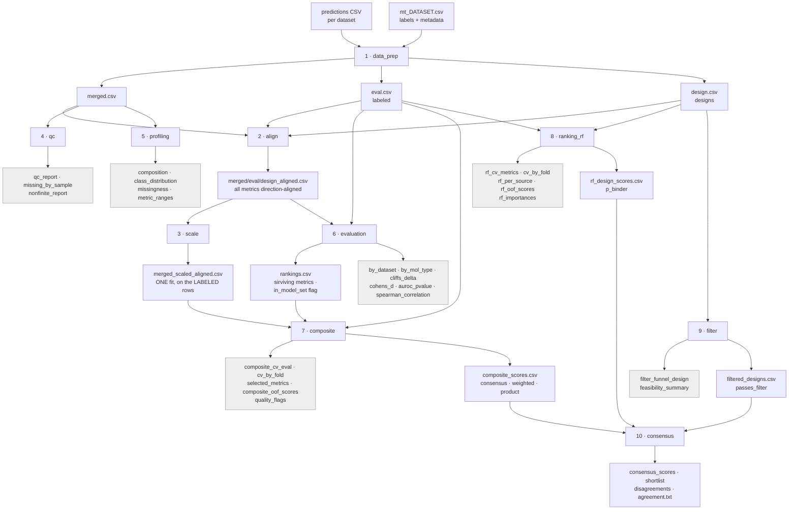
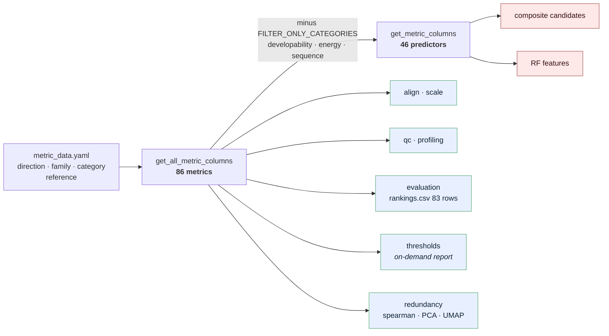
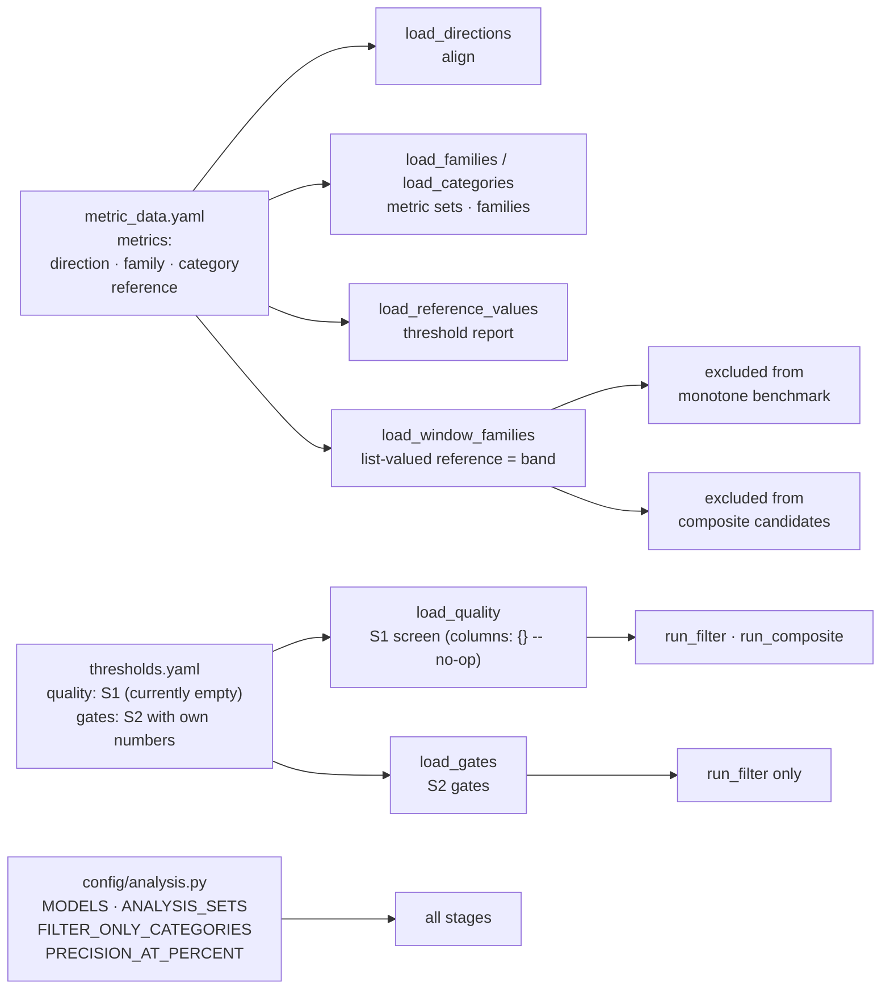
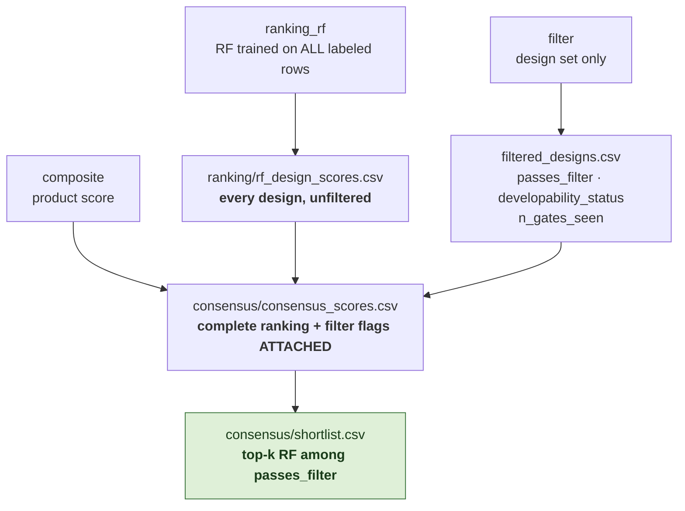
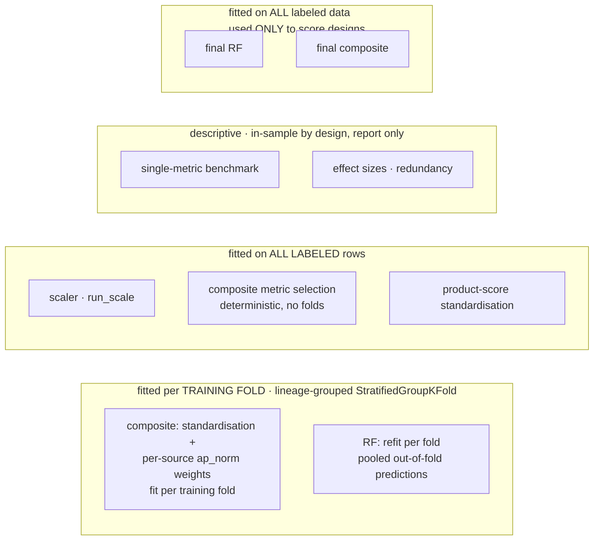

# Pipeline architecture

Diagrams of what the code actually does, for inspection.

---

## 1. Stage flow

Ten stages, run in order by `run_all.sh`, fail-fast. Blue = produces inputs for later stages,
grey = **report only** (nothing downstream reads it).

Note `qc` and `profiling` are terminal: they exist to characterise the data, and **nothing is built
on them**. `evaluation`'s `rankings.csv` is the one descriptive artefact that *is* reused (by
`composite`, via `analysis.io.rankings_for`), so the single-metric benchmark is computed once.

---

## 2. The two metric sets

The pipeline works with two column sets and every stage picks one **on purpose**. Running a
preselection analysis on the already-filtered set would be circular: it is the evidence used to
decide what to exclude.

Blue = descriptive / preselection, red = **fitted**. `rankings.csv` covers 83 of them (the 86 less the two-sided window families) and marks
membership with `in_model_set`, so the exclusions are evidenced rather than asserted.
`validate_pipeline.py` asserts predictor ⊂ full and that no filter-only category leaks into the
predictor set.

---

## 3. Configuration

Metric **metadata** and design-**filter** configuration are deliberately separate files, because
windowness is derived from the metadata and feeds the composite candidate pool.

---

## 4. Ranking vs filtering — three artefacts

Filtering never changes the ranking; it only selects from it at the last step. In increasing
restriction:

Two models are kept distinct inside `ranking_rf`: the lineage-grouped **CV models**, used only to
estimate performance, and the **final model** refit on all labeled rows, used only to score
designs. Filtering is **design-only** because the labeled benchmark pools antibody and nanobody
complexes, whose interfaces are not comparable.

How the CV numbers are read is itself a decision: **per-source columns are primary, pooled
columns are diagnostics.** `ap_norm_ds_mean` / `ap_norm_ds_min` normalise each source by its own
prevalence and then aggregate, because the four labeled sources differ in prevalence enough
that a pooled top-10% can be filled from one of them. Both the composite and the RF report it
through the same helper (`analysis.composite.per_source_metrics`) so the two are comparable.

---

## 5. Leakage boundaries

Lineage groups are `sample.split('_')[0]`; lineage groups over labeled rows. Because lineages nest
inside datasets, the grouped folds are close to **leave-one-source-out**, so the per-fold spread in
`cv_by_fold.csv` is cross-dataset transfer rather than sampling noise.

Known, deliberate exception: metric selection is **not** fold-local. `dataset_aware_select` ranks
families once, on all labeled rows, by prevalence-corrected PR-AUC averaged across sources
deterministically (with no folds and no seed). So the composite's cross-validated numbers are
out-of-fold *given that metric set*, not independent estimates. The RF has no selection step 
(fixed, label-independent features), so its estimate carries no selection bias.

---

## 6. Figure layer

Figures are a separate layer: no stage draws one, and no stage imports matplotlib. Each plot
function takes a pipeline output and renders it, so a figure cannot disagree with the number it
is drawn from.

| module | figures | driven by |
|---|---|---|
| `analysis/distributions/plots.py` | distributions, separability, model agreement, benchmark structure | `distributions_plots.ipynb` |
| `analysis/distributions/profiles.py` | sample / outlier / threshold views (notebook-only) | `profiles_plots.ipynb` |
| `analysis/evaluation/plots.py` | single-metric benchmark: metric bars, ROC/PR curves, quadrant, embeddings, Spearman heatmap | `evaluation_plots.ipynb` |
| `analysis/ranking/plots.py` | RF performance and importances, design scores, RF-vs-composite comparison | `ranking_plots.ipynb` |
| `analysis/plot_common.py` | `_finish` + the shared metric bar-chart machinery | (imported by the two above) |
| *(none)* | composite variants: `composite_plot.ipynb` draws inline from `analysis/composite` + `config/palette`, and writes the `variants/` tables below | `composite_plot.ipynb` |

Color comes from `config/palette.py` and follows the ENTITY, never the position in the figure,
so dropping a series never repaints the survivors. `analysis/figures.py` adds opt-in auto-save:
until a notebook calls `set_figure_dir()`, nothing is written to disk.

