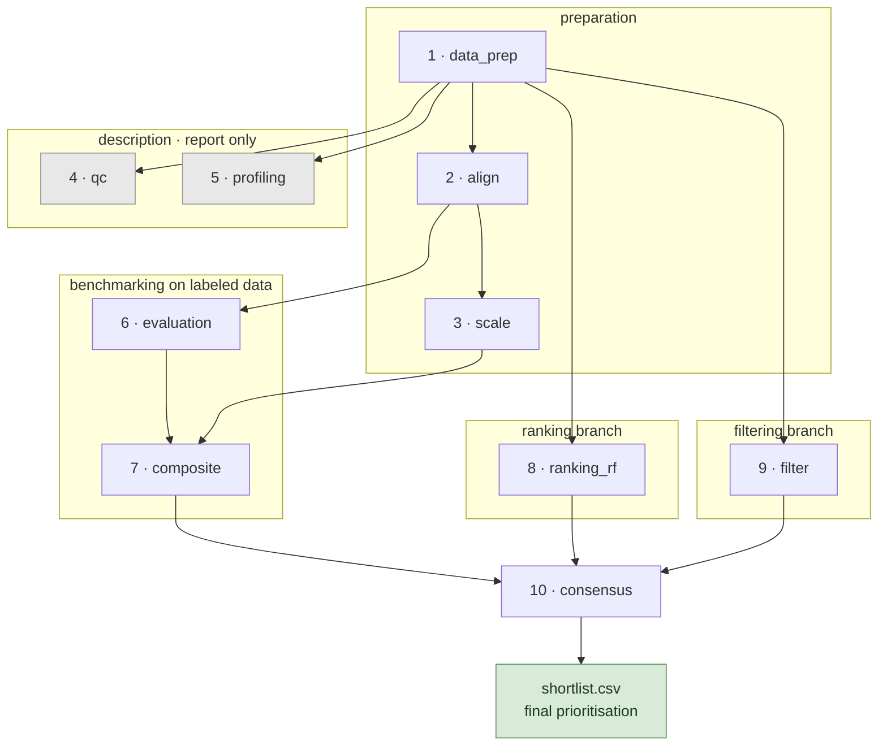
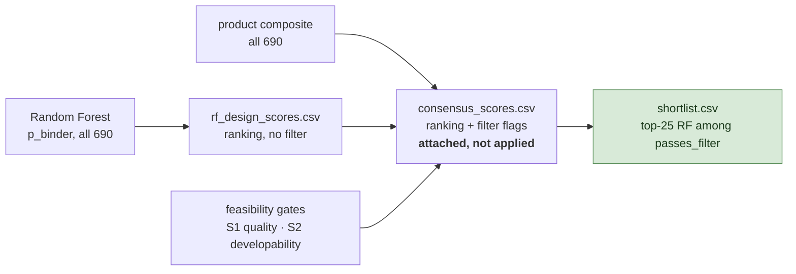
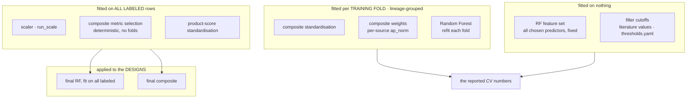

# Pipeline specification

A stage-by-stage contract: what each stage reads, what it writes, and what must hold for its
output to be valid. `ARCHITECTURE.md` has the narrative and the per-stage diagrams; this file is
the summary and the interface list. `run_all.sh` remains the source of truth for stage order.

 Regenerate with `DATASET=rf PYTHONPATH=. python validate_pipeline.py` (17 checks) and
`PYTHONPATH=. python -m pytest -q` (27 tests).

---

## 1. Summary

The pipeline answers three questions in order, and keeps them separate on purpose.

1. **Which computational metrics distinguish experimentally validated binders from non-binders?**
   A single-metric benchmark over the labeled data, reported per source as well as pooled.
2. **Does combining metrics rank better than any single one?** A composite score, built from the
   best metric per family and evaluated under lineage-grouped cross-validation, plus a Random
   Forest over all predictor metrics.
3. **Which unlabeled designs should be made?** The Random Forest ranks every design; a
   feasibility filter screens them on literature developability gates; the shortlist is the
   top-k of the ranking among designs that pass.

Two design decisions govern the whole thing:

- **Ranking and filtering are independent branches.** Filtering never reorders the ranking; it
  only selects from it, at the last step. The two meet once, at `consensus`.
- **Cutoffs and metric choices are derived on labeled data and applied to designs**, never the
  reverse. Every transformation that could leak (scaling, standardisation, weights, metric
  selection) is fitted on labeled rows or on training folds only.

---

## 2. Stage flow

Ten stages, fail-fast, one run directory per invocation (`runs/<dataset>_<timestamp>/`) holding
a config snapshot, a manifest with the exact package versions, and per-stage logs.

Grey stages are **report only** — nothing downstream reads them.

**Stage order is not the dependency graph.** `qc` and `profiling` read raw `merged.csv`, so neither
depends on `align` or `scale` despite running after them; they could run immediately after
`data_prep`. Only `composite` consumes the scaled table (for its score columns), and `ranking_rf`
and `filter` read the raw `eval.csv` / `design.csv` directly. The `run_all.sh` sequence is a
convenient linearisation, not a minimal one.

---

## 3. Stage contracts

| # | stage | reads | writes | invariant |
|---|---|---|---|---|
| 1 | `data_prep` | per-dataset prediction CSVs, `mt_<dataset>.csv` | `merged.csv`, `eval.csv`, `design.csv` | `binder ∈ {0,1}` → eval; `binder == "?"` → design. No row in both. |
| 2 | `align` | `merged.csv` | `*_aligned.csv` | after alignment **higher = better** for every metric; direction read from `metric_data.yaml`, never hardcoded |
| 3 | `scale` | `merged_aligned.csv` | `merged_scaled_aligned.csv` | one scaler per dataset selection, **fit on the labeled rows**, applied to all 823 |
| 4 | `qc` | `merged.csv` (raw) | `qc_report.csv`, `missing_by_sample.csv`, `nonfinite_report.csv` | duplicates, mislabeled target-shuffles, non-finite values and missingness are surfaced before any analysis |
| 5 | `profiling` | `merged.csv`, `eval.csv` (raw) | `composition.csv`, `class_distribution.csv`, `missingness*.csv`, `metric_ranges.csv`, `lineage_groups.csv`, `cv_folds.csv` | lineage groups = `sample.split('_')[0]`; the fold table is the same partition the CV stages use |
| 6 | `evaluation` | `eval_aligned.csv` | `rankings.csv`, `rankings_by_dataset.csv`, `rankings_by_mol_type.csv`, `cohens_d.csv` / `cliffs_delta.csv` (+ `_by_dataset`), `auroc_pvalue.csv`, `spearman_correlation.csv` | per-source columns (`ap_norm_ds_*`) are primary, pooled `pr_auc` is the diagnostic; point estimates only, no bootstrap |
| 7 | `composite` | `eval.csv`, scaled table, `rankings.csv` | `composite_cv_eval.csv`, `selected_metrics.csv`, `cv_by_fold.csv`, `composite_oof_scores.csv`, `composite_scores.csv`, `quality_flags.csv` | selection deterministic on labeled rows; standardisation and weights fitted per training fold for the reported numbers |
| 8 | `ranking_rf` | `eval.csv`, `design.csv` | `rf_cv_metrics.csv`, `rf_per_source.csv`, `rf_oof_scores.csv`, `rf_importances.csv`, `rf_design_scores.csv`, `cv_by_fold.csv` | features = all 46 predictor metrics, fixed and label-independent; grouped CV for the estimate, full fit only to score designs |
| 9 | `filter` | `design.csv`, `thresholds.yaml` | `filtered_designs.csv`, `filter_funnel_design.csv`, `feasibility_summary.csv` | gates applied in **raw units**; a design judged on fewer gates records `n_gates_seen` |
| 10 | `consensus` | `rf_design_scores.csv`, `composite_scores.csv`, `filtered_designs.csv` | `consensus_scores.csv`, `shortlist.csv`, `disagreements.csv`, `agreement.txt` | ranking order is the RF's alone; filtering selects, never reorders |

---

## 4. Ranking versus filtering

Three artefacts, in increasing restriction. This is the structure that keeps the two branches
independent.

The composite is a **complementary** ranker, not a component of the score: no combined number is
formed. The RF sets the order; the composite marks agreement (`consensus`) and disagreement
(`primary_only`), so a design supported by both is distinguishable from one carried by the RF alone.

---

## 5. What is fitted on what

The leakage structure, which is the part most worth checking.

**Lineage groups** are `sample.split('_')[0]`  Because lineages nest
inside sources, grouped folds are close to leave-one-source-out, so the per-fold spread in
`cv_by_fold.csv` is cross-source transfer, not sampling noise.

**The one asymmetry to state when comparing composite against RF:** the composite's metric set was
chosen using all labeled rows before the folds were drawn, so its cross-validated numbers are
out-of-fold *given that set* rather than independent. The RF's feature set is fixed and
label-independent, so its estimate carries no selection bias.

---

## 6. Configuration

Everything is config or environment; nothing is hardcoded in the stage scripts.

| file | holds |
|---|---|
| `config/metric_data.yaml` | canonical metric metadata — direction, family, category. Keys are full column names. The single source for alignment, family grouping and window detection. |
| `config/thresholds.yaml` | the only home for filter config, two keys: `quality` (S1, currently `columns: {}`) and `gates` (S2 — each gate carries its own value/bounds inline; there is no separate per-family `thresholds` block) |
| `config/analysis.py` | `MODELS`, `ANALYSIS_SETS`, `FILTER_ONLY_CATEGORIES`, `PRECISION_AT_PERCENT`, and the `META_COLS` / `EXCLUDE_COLS` that keep labels and experimental readouts out of every metric set |
| `config/palette.py` | palette for figures; `COLORS_MAP` is re-exported from `config/analysis.py` for the figure notebooks |
| `config/datasets.py` | `DatasetConfig`, dataset membership |
| `config/paths.py` | all paths, overridable by environment |

| variable | default | effect |
|---|---|---|
| `DATASET` | `rf` | which dataset or pooled set to run |
| `SCALER` | `standard` | `standard` or `robust` in `run_scale` |
| `SHORTLIST_K` | `25` | shortlist size |
| `COMPOSITE_SCORE` | `composite_product` | which composite column `consensus` uses |
| `PRECISION_AT_PERCENT` | `0.10` | top-fraction for precision@pct, overriding `config/analysis.py` in `run_evaluation` |
| `N_REPEATS` / `N_JOBS` | `50` / `2` | permutation repeats and workers in the report-only `run_rf_importance.py` |

Paths come from the same mechanism: `PROJECT_ROOT`, `DATA_DIR`, `RUNS_DIR` (all defaulting
inside the repository) and `EXTERNAL_DATA_ROOT`, which only `data_prep` uses to find the raw
prediction CSVs — its committed value is the placeholder `.../project/`, so set it before
regenerating inputs. Values may also be written as `KEY=VALUE` lines in a `.env` at the
repository root; real environment variables win over that file.

**Two metric sets.** `get_all_metric_columns` is every annotated numeric metric present in the
table (**86** for `rf`); `get_metric_columns` is the **predictor** set (**46**), which drops
`FILTER_ONLY_CATEGORIES`
(`developability`, `energy`, `sequence`). The benchmark describes all of them — `rankings.csv` carries **83**, the 86 less the two-sided
window families — while the composite and the RF may use only predictors. `validate_pipeline.py`
asserts the separation. (`metric_data.yaml` holds 187 entries in total: metadata for every
model×metric combination, most of which are absent from any one dataset selection.)

---

### Open items

- **S1 is off by decision**. `thresholds.yaml` has `quality: columns: {}` with its
  examples commented out, so the S1 confidence screen passes all 690 and S2 does all the work.
  The loader and the stage stay wired, so filling that block switches it back on.
- **The reported composite and the shipped composite are different code paths.**
  `cv_composite_scores` (fold-fitted, on raw `eval.csv`) produces the numbers;
  `build_composites` (fitted on labeled rows, on the scaled table) produces
  `composite_scores.csv`. Same formulas, different fitting — a change to one does not propagate.
- **Environment matters.** `StratifiedGroupKFold` partitions the lineage groups differently
  across scikit-learn versions, so every out-of-fold number shifts if the stack changes. The
  recorded environment is Python 3.11.14, numpy 2.4.2, pandas 3.0.1, scipy 1.17.1,
  scikit-learn 1.8.0 (the `pymol` micromamba env). Run manifests record it per run.
